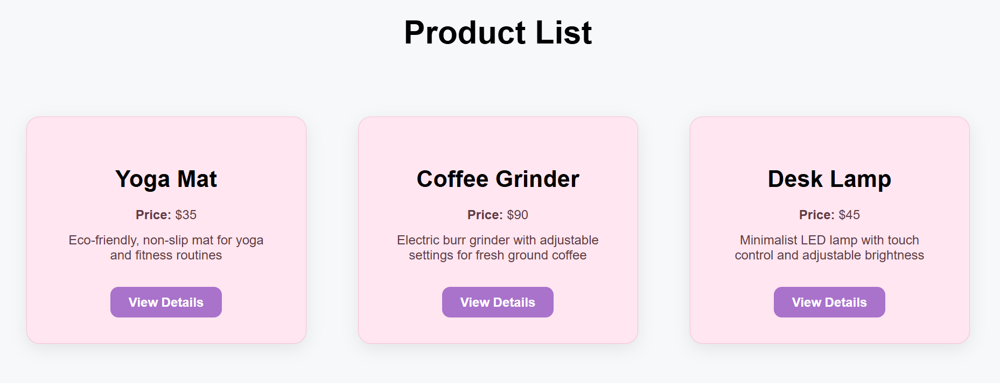
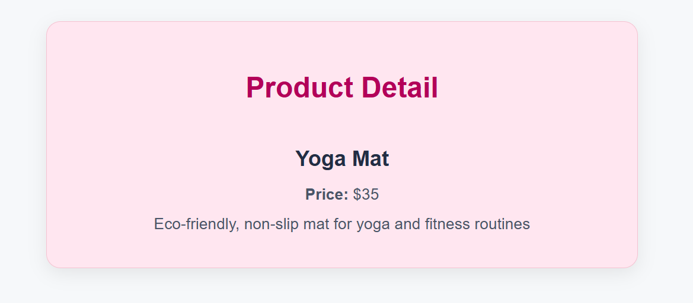

# 🛍️ React Product App

A simple and easy-to-use product listing website built with React.
You can view a list of products, click on any product to see more details, and enjoy a smooth, clean design. 

---

## 📸 Screenshots

### 🧾 Product List Page



### 📦 Product Detail Page



---

## 💻 How to Run This Project Locally


### 1. Download the App Files by Opening GitHub and click this link:
👉 https://github.com/mrumayi20/product-app <br>
Click the green "Code" button, then click "Download ZIP" <br>
Extract the ZIP file to your desktop or any folder

### 2. Run below commands on your terminal 
Go inside the project folder by running below command. If you're already in the project folder **product-app**, then skip this step.
```bash
cd product-app
```
### 2. Install all required packages by running these commands one by one
```bash

npm install
npm install react-router-dom
npm install rxjs

```
### 3. To run this project, execute below command on your terminal (Starting development server)

```bash
npm run dev
```

After running the above command, Vite will show a local development URL in your terminal — it usually looks like given below.<br>
Paste the below URL (or the exact one you see in your terminal) into your browser.
```
http://localhost:5173/products
```

---

## 🗃️ Project Structure

```
react-product-app/
├── public/                   # Static assets
├── src/
│   ├── components/           # UI components
│   │   ├── ProductCard.jsx
│   │   ├── ProductList.jsx
│   │   └── ProductDetail.jsx
│   ├── data/                 # Static product data
│   │   └── products.json
│   ├── services/             # service using RxJS
│   │   └── ProductService.js
│   ├── styles/               # CSS files per component
│   │   ├── ProductCard.css
│   │   ├── ProductList.css
│   │   └── ProductDetail.css
│   ├── App.jsx               # Route configuration
│   ├── main.jsx              # App entry point
│   └── index.css             # Global styles
├── .gitignore
├── index.html
├── package.json
├── vite.config.js
└── README.md                 # This file!
```

---

## 🎯 Features

- ✅ Product card components with dynamic data binding
- ✅ Emits click events from components to parent (`onClick`)
- ✅ `ProductService` with RxJS Observables
- ✅ Route-based navigation:
  - `/products` — Product List
  - `/products/:id` — Product Details
- ✅ Fully responsive layout
- ✅ Beginner-friendly code and structure

---

## 🙌 Author

Built by Mrunmayi Patil<br>
Feel free to reach out to me at mrunmayirpatil@gmail.com if you have any doubts.
